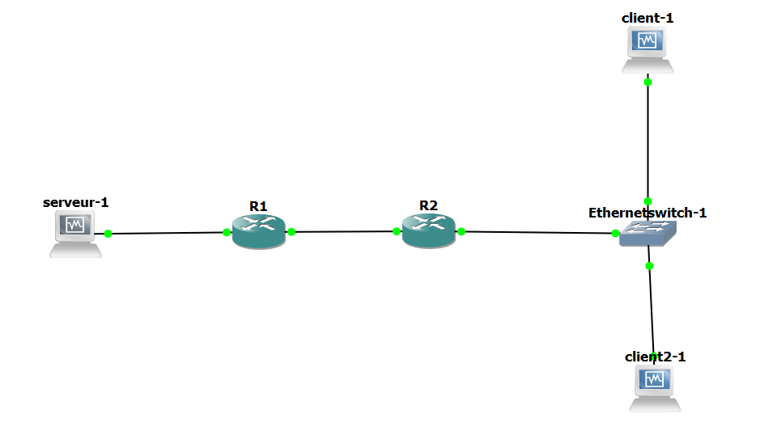

# TP 5 - Premier pas dans le monde Cisco
## I. Préparation du lab
Suivre les indications données dans le TP.



Machines :

Machine | net1 | net2 | net12
--- | :---: | :---: | :---:
client1.tp5 | X | 10.5.2.10 | X
client2.tp5 | X | 10.5.2.11 | X
router1.tp5 | 10.5.1.254 | X | 10.5.12.1
router2.tp5 | X | 10.5.2.254 | 10.5.12.2
server1.tp5 | 10.5.1.10 | X | X
## II. Lancement et configuration du lab
### 1. Checklist IP VMs 

On parle de client1.tp5, client2.tp5 et server1.tp5 :
* [✔] Désactiver SELinux
  * déja fait dans le patron
* [✔] Installation de certains paquets réseau
  * déja fait dans le patron
* [✔] Désactivation de la carte NAT
  * déja fait dans le patron
* [✔] Définition des IPs statiques
* [✔] La connexion SSH doit être fonctionnelle
  * une fois fait, vous avez vos trois fenêtres SSH ouvertes, une dans chaque machine
* [✔] Définition du nom de domaine

### 2. Checklist IP Routeurs 

On parle de router1.tp5 et router2.tp5 :
* [✔] Définition des IPs statiques
* [✔] Définition du nom de domaine
* Vérification :
    * Router1
    ```bash
    router1#show ip int br
    Interface                  IP-Address      OK? Method Status                Protocol
    Ethernet0/0                10.5.1.254      YES NVRAM  up                    up
    Ethernet0/1                10.5.12.1       YES NVRAM  up                    up
    Ethernet0/2                unassigned      YES NVRAM  administratively down down
    Ethernet0/3                unassigned      YES NVRAM  administratively down down
    ```

    * Router2
    ```bash
    router2#show ip int br
    Interface                  IP-Address      OK? Method Status                Protocol
    Ethernet0/0                10.5.2.254      YES NVRAM  up                    up
    Ethernet0/1                10.5.12.2       YES NVRAM  up                    up
    Ethernet0/2                unassigned      YES NVRAM  administratively down down
    Ethernet0/3                unassigned      YES NVRAM  administratively down down
    ```
### 3. Checklist routes 

On parle de toutes les machines :
* [✔] router1.tp5
  * directement connecté à net1 et net12
  * route à ajouter : net2 
  * Vérification :
    ```bash
        10.0.0.0/24 is subnetted, 3 subnets
    C       10.5.12.0 is directly connected, Ethernet0/1
    S       10.5.2.0 [1/0] via 10.5.12.254
                    [1/0] via 10.5.12.2
    C       10.5.1.0 is directly connected, Ethernet0/0
    
* [✔] `router2.tp5`
  * directement connecté à `net2` et `net12`  
  * route à ajouter : `net1` 
  * Vérification :
```bash
        10.0.0.0/24 is subnetted, 3 subnets
    C       10.5.12.0 is directly connected, Ethernet0/1
    C       10.5.2.0 is directly connected, Ethernet0/0
    S       10.5.1.0 [1/0] via 10.5.12.254
                    [1/0] via 10.5.12.1
```

* [✔] server1.tp5
  * directement connecté à net1
  * route à ajouter : net2
  * fichiers hosts à remplir : client1.tp5, client2.tp5
  * Vérification :
    * Client1
    ```bash
    [root@server1 etc]# ping client1
    PING client1 (10.5.2.10) 56(84) bytes of data.
    64 bytes from client1 (10.5.2.10): icmp_seq=1 ttl=62 time=36.9 ms
    ```

    * Client2
    ```bash
    [root@server1 etc]# ping client2
    PING client2 (10.5.2.11) 56(84) bytes of data.
    64 bytes from client2 (10.5.2.11): icmp_seq=1 ttl=62 time=38.9 ms
    ```
    
* [✔] client1.tp5
  * directement connecté à net2
  * route à ajouter : net1
  * fichiers hosts à remplir : server1.tp5.b1, client2.tp5.b1
  * Vérification :
    * Client2
    ```bash
    [root@client1 etc]# ping client2
    PING client2 (10.5.2.11) 56(84) bytes of data.
    64 bytes from client2 (10.5.2.11): icmp_seq=1 ttl=64 time=0.953 ms
    64 bytes from client2 (10.5.2.11): icmp_seq=2 ttl=64 time=2.09 ms
    ```

    * Server1
    ```bash
    [root@client1 etc]# ping server1
    PING server1 (10.5.1.10) 56(84) bytes of data.
    64 bytes from server1 (10.5.1.10): icmp_seq=7 ttl=62 time=28.8 ms
    ```


* [✔] client2.tp5
* directement connecté à net2
  * route à ajouter : net1
  * fichiers hosts à remplir : server1.tp5, client1.tp5
  * Vérification :
    * Client1
    ```bash
    [root@client2 etc]# ping client1
    PING client1 (10.5.2.10) 56(84) bytes of data.
    64 bytes from client1 (10.5.2.10): icmp_seq=1 ttl=64 time=0.890 ms
    64 bytes from client1 (10.5.2.10): icmp_seq=2 ttl=64 time=2.21 ms
    ```

    * Server1
    ```bash 
    [root@client2 etc]# ping server1
    PING server1 (10.5.1.10) 56(84) bytes of data.
    64 bytes from server1 (10.5.1.10): icmp_seq=1 ttl=62 time=40.4 ms
    64 bytes from server1 (10.5.1.10): icmp_seq=4 ttl=62 time=37.7 ms
    ```


## III. DHCP
### 1. Mise en place du serveur DHCP

* Vérification du renommage de la machine et activation du serveur DHCP :
    ```bash
    [root@dhcp-net2 dhcp]# systemctl status dhcpd
    ● dhcpd.service - DHCPv4 Server Daemon
    Loaded: loaded (/usr/lib/systemd/system/dhcpd.service; disabled; vendor preset: disabled)
    Active: active (running) since mar. 2019-02-19 11:24:21 CET; 15s ago
        Docs: man:dhcpd(8)
            man:dhcpd.conf(5)
    

* Vérification changement de l'adresse IP sur la carte enp0s3:
    ```bash
    2: enp0s3: <BROADCAST,MULTICAST,UP,LOWER_UP> mtu 1500 qdisc pfifo_fast state UP group default qlen 1000
        link/ether 08:00:27:40:24:0a brd ff:ff:ff:ff:ff:ff
        inet 10.5.2.50/24 brd 10.5.2.255 scope global noprefixroute dynamic enp0s3
        valid_lft 537sec preferred_lft 537sec
        inet6 fe80::a00:27ff:fe40:240a/64 scope link
        valid_lft forever preferred_lft forever
    


### 2. Explorer un peu DHCP
- Vérification des captures DORA :
```bash
16    48.859242    0.0.0.0    255.255.255.255    DHCP    342    DHCP Discover - Transaction ID 0x6965950e
20    49.862931    10.5.2.11 10.5.2.50    DHCP    342     DHCP Offer    - Transaction ID 0x6965950e
21    49.863440    0.0.0.0    255.255.255.255    DHCP    342    DHCP Request  - Transaction ID 0x6965950e
23    49.882600    10.5.2.11 10.5.2.50    DHCP    342    DHCP ACK      - Transaction ID 0x6965950e
